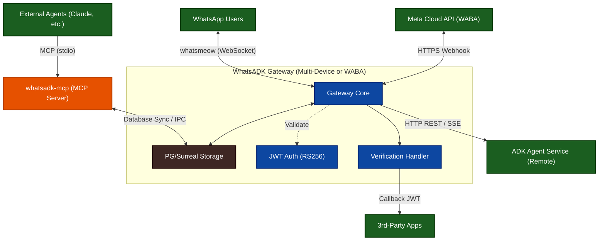

# Architecture

This document describes the architecture of **WhatsADK**, a Go gateway that bridges WhatsApp messaging with Google's Agent Development Kit (ADK) services.

## High-Level Overview



The gateway provides two entry points for WhatsApp connectivity:
1. **Multi-Device Gateway (`cmd/gateway`)**: Uses the unofficial `whatsmeow` library. It connects via WebSocket and supports QR-code based authentication.
2. **WABA Gateway (`cmd/waba-gateway`)**: Uses the official Meta WhatsApp Business Cloud API. It receives messages via HTTP webhooks and sends replies via the Meta Graph API.

Both gateways proxy messages to a remote ADK agent over HTTP. Responses from the agent are relayed back to the WhatsApp user.

The **MCP Server** is a secondary entry point that allows local AI agents to query the gateway's state (contacts, logs, blacklist) directly via the Model Context Protocol.

## Directory Structure

```
whatsadk/
├── cmd/
│   ├── gateway/main.go              # Multi-Device Gateway entry point
│   ├── waba-gateway/main.go         # WABA Cloud API Gateway entry point
│   ├── keygen/main.go               # Ed25519 key pair generator for OAuth
│   ├── mcp/main.go                  # MCP Server for agentic tool access
│   ├── simulator/main.go            # WhatsApp TUI simulator
│   └── adksim/main.go               # ADK Reverse TUI simulator
├── internal/
│   ├── config/config.go             # YAML configuration loader with env overrides
│   ├── whatsapp/                    # whatsmeow (Multi-Device) client logic
│   ├── waba/                        # WABA (Official Cloud API) client logic
│   ├── agent/client.go              # ADK HTTP client (REST & SSE modes)
│   ├── simulator/                   # Logic for the WhatsApp simulator
│   ├── adksim/                      # Logic for the ADK reverse simulator
├── auth/
│   ├── claims.go                # JWT custom claims struct (user_id, channel)
│   ├── jwt.go                   # RS256 JWT token generator
│   ├── eddsa.go                 # Ed25519 key loading (PEM/seed)
│   ├── oauth_token.go           # EdDSA JWT generator for OAuth flow
│   ├── oauth_handler.go         # AUTH command parser, rate limiter, deep link builder
│   ├── key_registry.go          # Public key registry for app verification
│   └── verify_token.go          # Verification token detection & validation
├── cron/
│   ├── manager.go               # Cron-based job scheduling and execution
│   └── store.go                 # Summary persistence (filesys table)
├── verification/
│   └── handler.go               # Reverse OTP verification handler

├── config/config.yaml               # Default configuration file
└── docs/                            # Design docs and reference material
```

## Package Responsibilities

### `cmd/gateway` — Entry Point

The `main.go` file orchestrates startup:

1. Loads configuration via `config.Load()`
2. Optionally initializes `auth.JWTGenerator` (RS256 signing)
3. Optionally initializes `verification.Handler` (reverse OTP)
4. Optionally initializes `auth.OAuthHandler` (EdDSA WhatsApp OAuth)
5. Creates `agent.Client` (ADK HTTP client)
6. Creates `whatsapp.Client`, connects, and enters the run loop

All dependencies are wired manually — no DI framework is used.

### `cmd/mcp` — MCP Server

The `main.go` file implements a Model Context Protocol server:

1. Loads configuration via `config.Load()`
2. Connects to the shared PostgreSQL or SurrealDB database via `internal/store`
3. Exposes tools for external agents:
    - `blacklist_add`: Adds a number to the local `blacklisted_numbers` table **and** enqueues a command for the Gateway to perform a remote block on WhatsApp.
    - `blacklist_remove`: Removes a number from local blacklist **and** enqueues a remote unblock command.
    - `blacklist_get_remote`: Fetches the official blocklist directly from WhatsApp servers (via Gateway).
    - `query_contacts`: Search synchronized WhatsApp contacts.
    - `get_message_logs`: Inspect the `filesys` table for recent traffic.
4. **Command Queue (IPC)**: Since the MCP server and Gateway are separate processes, they communicate via a `whatsmeow_commands` table in the shared database. The MCP server enqueues requests, and the Gateway polls this table to execute them using its active WhatsApp session.
5. Communicates over `stdio` for seamless integration with Claude Code, Cursor, and other local dev tools.

### `internal/config` — Configuration

Loads a `config.yaml` file with a well-defined search order:

1. `-config` CLI flag
2. `CONFIG_FILE` environment variable
3. `./config.yaml`
4. `./config/config.yaml`
5. Executable directory (`config.yaml` or `config/config.yaml`)

After loading YAML, applies sensible defaults and overrides from environment variables (`ADK_ENDPOINT`, `ADK_APP_NAME`, `ADK_API_KEY`, etc.). The default endpoint is `http://localhost:8000/api`.

**Key config structs:** `Config`, `WhatsAppConfig`, `ADKConfig`, `AuthConfig`, `VerificationConfig`

### `internal/whatsapp` — WhatsApp Client & Media Bridge

Wraps the [whatsmeow](https://github.com/tulir/whatsmeow) library and provides media transformation:

- **QR code authentication** — displays QR in terminal on first run
- **Persistent sessions** — stored in PostgreSQL (via `sqlstore`) or SurrealDB (via `surrealStore`)
- **Two-Way Media Bridge (`media.go`)** — Normalizes media and metadata between WhatsApp and ADK:
    - **Normalization Layer:** Transforms platform-specific formats into a unified ADK standard (`agent.Part`).
    - **Inbound (WA ➔ ADK):** 
        - **Images:** Automatically resized and normalized to **896x896 JPEG**. 
        - **Audio:** Converted to **16kHz Mono WAV**.
        - **Video:** Sampled at **1 FPS** into JPEG frames.
        - **Location:** Standardized as a **Text Part** (e.g., `Location: [lat, lng]`) to ensure compatibility with LLM text reasoning.
    - **Outbound (ADK ➔ WA):** Uploads media parts from ADK to WhatsApp servers and sends them as native WhatsApp messages (Image, Audio, Video, Document). Text parts are sent as standard conversation messages.
- **Message event handling** — routes incoming messages through a pipeline:
  1. Ignores messages from self and group chats
  2. Extracts text from conversation or extended text messages
  3. Checks global blacklist and drops blocked users
  4. Checks for verification tokens → delegates to `verification.Handler`
  5. Checks for AUTH commands → delegates to `auth.OAuthHandler` (if enabled)
  6. **LID Resolution** — if the sender has a Linked Identity (LID), automatically attempts to resolve it to a phone number (PN) using the local cache or a server lookup.
  7. Applies access control (allows all by default, or filters by whitelist/India/PN if whitelist is active)
  8. Forwards to `agent.Client.Chat()` and sends the response back
- **Graceful shutdown** — listens for `SIGINT`/`SIGTERM`

### `internal/waba` — Official WABA Client

Implements the integration with Meta's WhatsApp Business Cloud API:

- **Webhook Handling (`webhook.go`)** — Handles verification and decryption of incoming messages from Meta.
- **Graph API Client (`client.go`)** — Manages sending messages and uploading media via the Meta Graph API.
- **Media Support:**
    - **Inbound:** Resolves `media_id` from incoming messages, downloads binary data, and prepares it for ADK normalization.
    - **Outbound:** Uploads media to Meta's servers to obtain a `media_id` before sending the message. Currently focuses on **Image** support.
- **Normalization:** Aligns WABA-specific message structures with the unified `agent.Part` standard used throughout the gateway.

### `internal/agent` — ADK Client

HTTP client for the ADK Agent service. Supports two modes:

- **`/run` (synchronous)** — POSTs a `RunRequest`, receives a JSON array of `Event` objects
- **`/run_sse` (streaming)** — POSTs to `/run_sse` with `Accept: text/event-stream`, parses SSE `data:` lines

Both modes extract the final model response from the event list (last non-partial `model` event). The client also manages per-user sessions via `POST /apps/{app}/users/{user}/sessions/{session}`.

Authentication is layered: JWT (RS256) takes priority over static API key.

### `internal/auth` — Authentication

#### JWT Generator (`jwt.go`)

Generates short-lived RS256 tokens with custom claims:

- `user_id` — WhatsApp sender's phone number
- `channel` — always `"whatsapp"`
- Standard claims: `iss`, `aud`, `iat`, `exp`

Supports both default audience (`Token()`) and per-audience tokens (`TokenWithAudience()`) used for verification callbacks.

#### Key Registry (`key_registry.go`)

Loads RSA public keys for registered third-party apps from PEM files. Used by the verification subsystem to validate incoming verification tokens.

#### OAuth (EdDSA) Authentication (`eddsa.go`, `oauth_token.go`, `oauth_handler.go`)

Provides WhatsApp-based OAuth login using Ed25519/EdDSA-signed JWTs:

- `LoadEdDSAKey()` — loads an Ed25519 private key from PEM (PKCS#8) or raw 32-byte seed
- `OAuthTokenGenerator` — creates EdDSA JWTs with `sub` (phone), `iss`, `aud`, `nonce`, and `pubkey` claims
- `OAuthHandler` — parses `AUTH <pubkey> <nonce>` WhatsApp messages, validates the public key, enforces per-phone rate limits (default 5/hour), and returns a deep link containing the signed JWT

The resulting JWT is ~350 characters — compact enough for WhatsApp URL delivery.

#### Verification Token Detection (`verify_token.go`)

- `IsVerificationToken()` — quick heuristic check: starts with `eyJ`, has 3 dot-separated parts, and contains the required claims (`mobile`, `app_name`, `callback_url`)
- `VerifyVerificationToken()` — full cryptographic verification using the app's registered public key

### `internal/cron` — Cron Heartbeats

Manages periodic A2A (Agent-to-Agent) tasks:

- **Scheduling** — uses `robfig/cron/v3` to execute jobs based on cron expressions.
- **Memory Persistence (`store.go`)** — saves the summary of each run to the `filesys` table (`cron/<job_name>/summary`).
- **Execution (`manager.go`)** — retrieves the previous summary, injects it into the next agent request, and captures the new response as the next summary.

### `internal/verification` — Reverse OTP

Handles the reverse OTP verification flow:

1. Detects verification tokens in incoming WhatsApp messages
2. Looks up the app's public key from `KeyRegistry`
3. Cryptographically verifies the token signature and expiry
4. Validates the sender's phone number matches the `mobile` claim
5. Signs a callback JWT (with audience set to the app name)
6. POSTs the signed JWT to the app's `callback_url`
7. Returns a user-facing confirmation/error message

### Simulators — Testing Tools

The project includes two TUI-based simulators for end-to-end testing without physical devices:

#### WhatsApp Simulator (`internal/simulator`)
Simulates the **WhatsApp ➔ Gateway** flow. It sends text and media to the gateway as if they came from a real WhatsApp user. It also saves media received from the agent to `media_received/`.

#### ADK Reverse Simulator (`internal/adksim`)
Simulates the **Gateway ➔ ADK** flow. It acts as the ADK server, listening for `/run` and `/run_sse` requests. A human operator uses the TUI to provide the agent's response (text and media), allowing manual testing of the gateway's outbound delivery logic. Incoming media from WhatsApp is saved to `adk_media_received/`.

## Data Flow

### Standard Message Flow

```
WhatsApp User
    │
    ▼ (WebSocket for Multi-Device / Webhook for WABA)
whatsapp.Client.handleMessage() or waba.WebhookHandler.onMessageParts()
    │
    ├─ Skip: from self, group chat, empty text (if applicable)
    │
    ├─ Check: Is user blacklisted? (PostgreSQL/SurrealDB)
    │
    ├─ Resolve: If LID, attempt resolution to PN (Cache/Lookup - Multi-Device only)
    │
    ├─ Check: Is user allowed? (whitelist / allow-all fallback)
    │
    ├─ Normalization Layer: Process images (896px JPEG), audio, video, location
    │
    ▼
agent.Client.ChatParts()
    │
    ├─ EnsureSession() → POST /apps/{app}/users/{user}/sessions/{session}
    │
    ├─ chatRun()    → POST /run      (if streaming=false)
    │  or
    ├─ chatSSE()    → POST /run_sse  (if streaming=true)
    │
    ▼
extractFinalParts() → all parts (text + inlineData) from model message
    │
    ▼
Gateway Client → sendADKParts() back to user (Multi-Device or WABA)
```

### Reverse OTP Verification Flow

```
3rd-Party App                     WhatsApp User                Gateway
    │                                  │                          │
    ├─ Generate signed JWT ──────────▶ │                          │
    │  (mobile, app_name,              │                          │
    │   callback_url, challenge_id)    │                          │
    │                                  ├─ Send JWT as message ──▶ │
    │                                  │                          ├─ Detect token (IsVerificationToken)
    │                                  │                          ├─ Lookup app public key
    │                                  │                          ├─ Verify signature & expiry
    │                                  │                          ├─ Match sender phone vs claim
    │                                  │                          ├─ Sign callback JWT
    │  ◀─── POST callback_url ────────────────────────────────────┤
    │       (Bearer: signed JWT)       │                          │
    │                                  │ ◀── Confirmation msg ────┤
```

### WhatsApp OAuth Flow

```
SPA (Browser)                  WhatsApp User             Gateway                    ADK Server
    │                               │                       │                          │
    ├─ Generate Ed25519 key pair    │                       │                          │
    ├─ Generate nonce               │                       │                          │
    ├─ Open wa.me deep link ──────▶ │                       │                          │
    │  AUTH <pubkey> <nonce>         │                       │                          │
    │                               ├─ Send message ──────▶ │                          │
    │                               │                       ├─ Parse AUTH command       │
    │                               │                       ├─ Validate pubkey (32B)    │
    │                               │                       ├─ Check rate limit         │
    │                               │                       ├─ Sign EdDSA JWT           │
    │                               │ ◀── Deep link reply ──┤                          │
    │                               │  <SPA>/auth#token=JWT │                          │
    │ ◀── User clicks link ─────── │                       │                          │
    ├─ Parse JWT + nonce from #     │                       │                          │
    ├─ Store JWT                    │                       │                          │
    ├─ Authorization: Bearer JWT ──────────────────────────────────────────────────────▶│
    │                               │                       │                          ├─ Verify EdDSA sig
    │ ◀────────────────────────────────────────────────────────────────── API response ─┤
```

## Key Dependencies

| Dependency | Purpose |
|---|---|
| [whatsmeow](https://github.com/tulir/whatsmeow) | WhatsApp Web multi-device API (WebSocket) |
| [lib/pq](https://github.com/lib/pq) | PostgreSQL driver for WhatsApp session persistence |
| [surrealdb.go](https://github.com/surrealdb/surrealdb.go) | Go client for SurrealDB backend persistence |
| [golang-jwt/jwt/v5](https://github.com/golang-jwt/jwt) | RS256 & EdDSA JWT token generation and parsing |
| [qrterminal](https://github.com/mdp/qrterminal) | QR code rendering in terminal |
| [yaml.v3](https://pkg.go.dev/gopkg.in/yaml.v3) | YAML configuration parsing |
| [protobuf](https://pkg.go.dev/google.golang.org/protobuf) | WhatsApp message protocol buffer serialization |

## Security Model

### Algorithm Selection Rationale
The project uses two distinct cryptographic standards to balance industry compatibility with mobile performance:

- **RS256 (RSA-2048)** is used for **System-to-System Auth**. It is the standard for service-to-service communication, ensuring the Gateway can authenticate with ADK servers and 3rd-party callbacks using widely supported libraries.
- **EdDSA (Ed25519)** is used for **User-to-System OAuth**. It provides significantly smaller keys (32B) and signatures, resulting in compact JWTs (~350 chars) that fit easily within WhatsApp deep-links and mobile intent handlers, where RSA tokens (~800+ chars) would be unwieldy.

### Security Features
- **JWT Auth (RS256)** — asymmetric signing ensures the ADK service can verify requests without sharing the private key. Tokens are short-lived (default 2 minutes).
- **OAuth (EdDSA)** — Ed25519-signed JWTs for WhatsApp deep-link delivery. The JWT binds the user's phone number to the SPA's ephemeral public key. Rate-limited to 5 AUTH requests per phone per hour.
- **TOTP Binding** — The Ed25519 public key is bound to the TOTP generation process, ensuring that codes are valid only when presented alongside the specific device key used during OAuth.
- **API Key fallback** — when JWT is not configured, a static API key can be used (less secure, suitable for development).
- **Verification token validation** — incoming tokens are cryptographically verified against pre-registered app public keys. Phone number matching prevents token forwarding attacks.
- **Global Blacklist** — users can be globally blocked across the gateway via PostgreSQL or SurrealDB. Blocking applies to both phone numbers and their associated LIDs.
- **Access control** — allows all users by default. If a whitelist is provided, only whitelisted users or Indian (+91) numbers are allowed. LIDs are automatically resolved to phone numbers to ensure they match whitelist/country rules. Non-allowed users receive a rejection message.

## Memory Persistence Patterns

WhatsADK employs two distinct memory strategies depending on the source of the interaction:

### 1. User Session Memory (Backend-Managed)
For standard WhatsApp users, the gateway acts as a stateless proxy for conversation history:
- **Session ID:** The user's phone number is used as both the `UserID` and `SessionID` in ADK requests.
- **State Responsibility:** The remote ADK Agent service is responsible for maintaining the dialogue state and history for that session.
- **Local Logs:** While the gateway logs all requests/responses in the `filesys` table for auditability and MCP access, it does **not** re-inject these logs into the agent's prompt.

### 2. Cron Heartbeat Memory (Gateway-Managed)
For automated heartbeat jobs, the gateway manages state transitions locally to ensure continuity across periodic runs:
- **Summary Storage:** The output of each job is saved as a "Summary" in the `filesys` table at `cron/<job_name>/summary`.
- **Context Injection:** Before each run, the `CronManager` retrieves the previous summary and prepends it to the job's `message` as a "Previous Run Summary" block.
- **A2A Continuity:** This pattern allows the agent to maintain context about its own past actions (e.g., "In the last check, I noticed X, so now I will check Y") without needing the ADK backend to maintain a persistent, long-lived session state for the heartbeat user.

## Build & Test

```bash
# Build
go build -o whatsadk ./cmd/gateway

# Run all tests
go test ./...

# Run specific test
go test -run TestName ./internal/auth/
```
