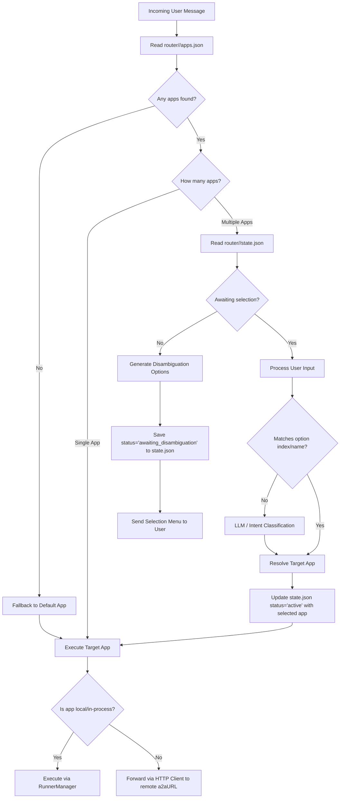
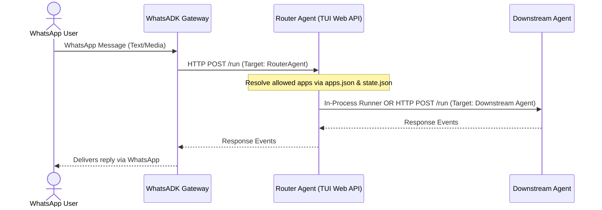

# WhatsADK: Routing and Application Provisioning Flow

This document describes the routing engine architecture and app provisioning flow in **WhatsADK**, detailing how the gateway manages multiple agent applications per user using the virtual file system, MCP server, and the Router Agent.

---

## 1. Overview

By default, the WhatsADK Gateway routes all messages to a single, globally configured ADK application (`cfg.ADK.AppName`). However, in multi-agent environments, different users may have access to different sets of applications. 

The **Router Agent** (located in [examples/router](file:///home/innomon/orez/adk/whatsadk/examples/router/)) acts as a meta-agent that intercepts incoming messages, resolves the user's provisioned application set, handles disambiguation/selection menus, and forwards execution to the appropriate downstream agent.

---

## 2. Storage & Virtual File System (VFS) Keys

The router flow relies on two dynamic files stored in the gateway's `filesys` table/collection:

### A. Allowed Apps List (`router/<userID>/apps.json`)
Stores a JSON array of string identifiers representing the ADK applications provisioned (or allowed) for a specific user.
* **Path key in VFS**: `router/<userID>/apps.json`
* **Format**:
  ```json
  ["shopper-agent", "weather-agent", "support-bot"]
  ```

### B. Routing State (`router/<userID>/state.json`)
Stores the current interactive routing session status for the user (e.g. if they are in the middle of choosing an app from a menu).
* **Path key in VFS**: `router/<userID>/state.json`
* **Format**:
  ```json
  {
    "status": "awaiting_disambiguation",
    "options": ["shopper-agent", "weather-agent"],
    "app": ""
  }
  ```

---

## 3. MCP Provisioning Interface (Tools)

Local AI agents can inspect and modify a user's provisioned apps and state using the following Model Context Protocol (MCP) tools:

* **`router_get_apps`**: Reads `router/<userID>/apps.json` and returns the array of allowed app names.
* **`router_set_apps`**: Marshals a string slice of application names and saves it to `router/<userID>/apps.json`.
* **`router_delete_apps`**: Deletes the `router/<userID>/apps.json` file.
* **`router_get_state`**: Retrieves `router/<userID>/state.json`.
* **`router_set_state`**: Saves or updates `router/<userID>/state.json`.
* **`router_clear_state`**: Clears the session routing state by deleting `router/<userID>/state.json`.

---

## 4. End-to-End Routing Lifecycle

When a message is received from a WhatsApp user, the Router Agent executes the following lifecycle:



### Steps:
1. **App Discovery**: The router checks `router/<userID>/apps.json` to fetch the allowed apps. If empty, the default application is used.
2. **Direct Route**: If only a single app is provisioned, the message is immediately routed to that application.
3. **Disambiguation / Multi-App State**: 
   * If multiple apps are allowed, the router checks `router/<userID>/state.json`.
   * If the state is not awaiting selection, the router generates a menu list of options (e.g., `[1] Shopper Assistant, [2] Weather Agent`) and sends it back to the user on WhatsApp, writing the pending options state to `router/<userID>/state.json`.
   * When the user replies, the router intercepts the reply, validates it against the active options index/names, or uses an LLM classification step to select the matching application.
4. **Target Execution**:
   * Once selected, the target app is stored in the state.
   * If the target app is configured locally in `shopper-agentic.yaml`, it executes in-process via `RunnerManager`.
   * Otherwise, the router acts as an HTTP proxy, forwarding the message payload directly to the app's external endpoint (`a2aURL`).

## 5. Code Implementation Map

The actual routing execution flow resides inside the `routerRun` handler within [examples/router/main.go](file:///home/innomon/orez/adk/whatsadk/examples/router/main.go):

### A. apps.json Reading and Resolution
The configuration loading and JSON unmarshaling occur at [examples/router/main.go:L213-L219](file:///home/innomon/orez/adk/whatsadk/examples/router/main.go#L213-L219):
```go
// 5. Read router/<userID>/apps.json
appsFile, err := dbStore.GetFile(ctx, "router/"+userID+"/apps.json")
var userApps []string
if err == nil && appsFile != nil {
    json.Unmarshal(appsFile.Content, &userApps)
}
```

### B. Calling Local In-Process ADK Agents
If the target application runner configuration is registered locally (in-process), execution is managed via `RunnerManager.Get` and invokes the runner's `Run` loop directly (utilizing the ADK v2 streaming signature) at [examples/router/main.go:L318-L342](file:///home/innomon/orez/adk/whatsadk/examples/router/main.go#L318-L342):
```go
if rnr, ok := runnerManager.Get(targetApp); ok {
    sessionID := invCtx.Session().ID()
    msg := &genai.Content{
        Role:  "user",
        Parts: invCtx.UserContent().Parts,
    }
    events := rnr.Run(ctx, userID, sessionID, msg, adkagent.RunConfig{})
    for ev, err := range events {
        // ... yield events to the connection
    }
    return
}
```

### C. Calling Remote Out-of-Process ADK Agents
If the application is external, the Router Agent instantiates an HTTP API client targeting the remote `a2aURL` and triggers standard ADK chat interactions at [examples/router/main.go:L344-L350](file:///home/innomon/orez/adk/whatsadk/examples/router/main.go#L344-L350):
```go
appClient := agent.NewClient(&config.ADKConfig{Endpoint: app.A2AURL, AppName: app.ADKAppName}, nil)
parts := genaiToAgentParts(invCtx.UserContent().Parts)
respParts, err := appClient.ChatParts(ctx, userID, parts)
```

## 6. How the Router Integrates with WhatsADK

The Router Agent runs as a standalone server, acting as a middle-tier proxy between the WhatsADK Gateway and the individual downstream agent applications.

### A. Execution Sequence



### B. Deployment & Configuration

1. **Start the Router Server**:
   Launch the Router Agent as an HTTP web API server:
   ```bash
   go run examples/router/main.go web api
   ```
   *Note: This starts the router agent listening for client connections (typically on port `8080` or `8000`).*

2. **Configure the Gateway**:
   In the WhatsADK Gateway's configuration file (`config/config.yaml`), point the `adk` settings directly to the Router Agent's endpoint:
   ```yaml
   adk:
     endpoint: "http://localhost:8080"  # The address of the running Router Agent
     app_name: "RouterAgent"            # Target matching the registered agent name
     enabled: true
   ```
