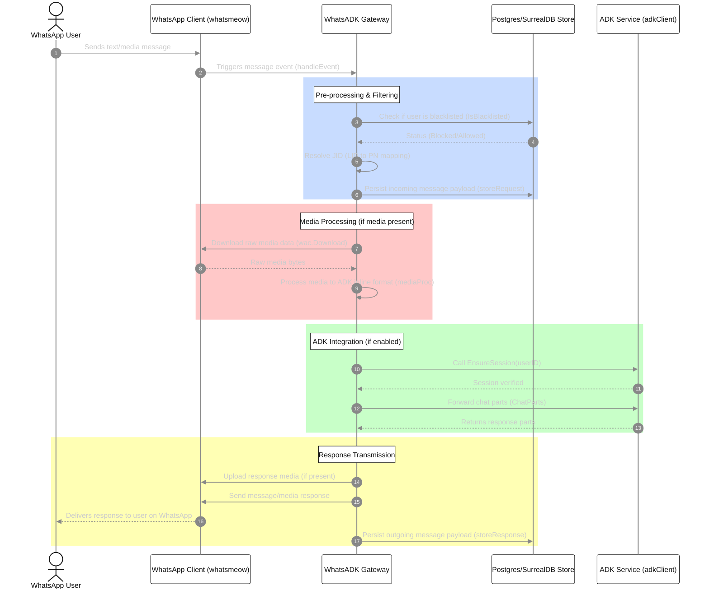

# WhatsADK: End-to-End WhatsApp User Interaction Flow

This document provides a technical walkthrough of how the WhatsADK Gateway receives, filters, processes, forwards, and responds to messages from WhatsApp users.

---

## 1. Why `cmd/gateway/main.go` Checks for `cfg.ADK.Endpoint`

In [main.go](file:///home/innomon/orez/adk/whatsadk/cmd/gateway/main.go), the gateway performs a startup validation to ensure `cfg.ADK.Endpoint` is not empty:

```go
if cfg.ADK.Endpoint == "" {
    fmt.Println("Error: ADK endpoint is required")
    fmt.Println("Set it in config.yaml or via ADK_ENDPOINT environment variable")
    os.Exit(1)
}
```

### Purpose of the Validation
1. **Bridge Role**: The gateway acts as a bridge between WhatsApp (using the `whatsmeow` library) and the Agent Development Kit (ADK) service (using the `adk-go` SDK). Its core autonomous function is to forward user messages to the AI agent and return the agent's replies back to the user.
2. **Routing Target**: The `cfg.ADK.Endpoint` specifies the base URL of the ADK service APIs (e.g., `http://localhost:8000/api`). The HTTP client in [internal/agent/client.go](file:///home/innomon/orez/adk/whatsadk/internal/agent/client.go) uses this URL to hit `/run` or `/run_sse` endpoints.
3. **Fail-Fast Principal**: Without this endpoint, the gateway has no destination to forward messages to. Rather than booting successfully but silently failing (or throwing nil pointer dereferences/network errors) when the first user sends a message, the gateway fails fast at startup.

---

## 2. End-to-End Lifecycle of a User Interaction

Below is a step-by-step breakdown of how a user's interaction moves through the gateway, from message composition to response delivery.



---

### Step 1: Ingestion & Parsing
When a user sends a message, the underlying WhatsApp connection receives the event.
- **Entrypoint**: `whatsmeow` triggers `handleEvent` inside [internal/whatsapp/client.go](file:///home/innomon/orez/adk/whatsadk/internal/whatsapp/client.go), which delegates to `handleMessage()`.
- **Group Bypass**: The gateway ignores group chat events to prevent infinite loops or unwanted bot spam:
  ```go
  if msg.Info.IsGroup {
      return
  }
  ```
- **Note-to-Self**: Messages sent from the owner's own JID to themselves are handled specially (stored but not re-routed, unless config permits).

### Step 2: LID Resolution & Identity Mapping
WhatsApp uses internal Linked IDs (LIDs) representing users on the server side. 
- The gateway calls `resolveLID()` to fetch the user's actual Phone Number (PN) JID (e.g. `91xxxxxx@s.whatsapp.net`).
- It checks local storage first, falling back to an on-demand query from the WhatsApp servers if missing.

### Step 3: Access Control & Blacklist Verification
Before handling any logic:
1. **Global Blacklist**: The gateway queries the database via `c.store.IsBlacklisted(ctx, userID)` to check if the sender is blacklisted. If they are, the message is dropped.
2. **Whitelist / Geo-Enforcement**: The gateway executes `c.isUserAllowed()`.
   - If `whitelisted_users` is configured in `config.yaml`, only listed users are allowed.
   - If no whitelist is defined, the gateway falls back to country-code checks (e.g. enforcing the `91` Indian prefix).
   - Non-allowed users receive a default refusal response and processing stops.

### Step 4: Storage of Incoming Requests
The incoming request payload is stored in the database for tracking and analysis:
- The text/mime-type of the message is logged via `c.storeRequest()`.
- If media is attached, the raw bytes are downloaded via `c.wac.Download()` and stored as well.

### Step 5: Special Command Handlers (Bypassing ADK)
Before invoking the AI, the gateway checks if the message corresponds to administrative operations:
- **Verification Token**: If the message contains a validation string (like a verification link callback), it invokes `verifyHandler.Handle()`.
- **OAuth Commands**: If the message starts with an authentication request, it invokes `oauthHandler.Handle()` to construct secure login tokens using EdDSA.

### Step 6: Media Parsing
If the message contains an image, video, audio, or document:
- The gateway routes the raw downloaded bytes to `mediaProc` ([internal/whatsapp/media.go](file:///home/innomon/orez/adk/whatsadk/internal/whatsapp/media.go)).
- The processor converts the media into base64-encoded `InlineData` structures compatible with the ADK payload format.

### Step 7: Forwarding to the ADK Service
If autonomous agent mode is enabled (`cfg.ADK.Enabled` is true):
1. **Ensure Session**: The client calls `EnsureSession()` on the ADK endpoint to check or initialize a session matching the user's phone number.
2. **Forwarding Parts**: Both text and media inputs are encapsulated into `agent.Part` slices and sent to the ADK backend via `adkClient.ChatParts()`.
3. **Streaming vs. Blocking**:
   - If streaming is configured (`cfg.ADK.Streaming`), it communicates using server-sent events (`/run_sse`).
   - Otherwise, it does a single blocking POST to `/run`.

### Step 8: Outbound Response Processing
Upon receiving response parts from the ADK service:
1. **Silent Ignore Check**: If any part contains a mime-type matching `application/x-adk-silent-ignore`, the response is skipped.
2. **Media Upload**: For response parts containing media:
   - The gateway decodes the base64 media payload.
   - It uploads it to the WhatsApp servers via `c.wac.Upload()`.
3. **Outbound Dispatch**:
   - Text messages are sent via `c.wac.SendMessage()` as a standard string.
   - Media messages are sent with appropriate proto structures containing the server URL, direct path, media keys, and caption.
4. **Audit Logging**: Successful outbound messages are written to the database logs using `c.storeResponse()`.
