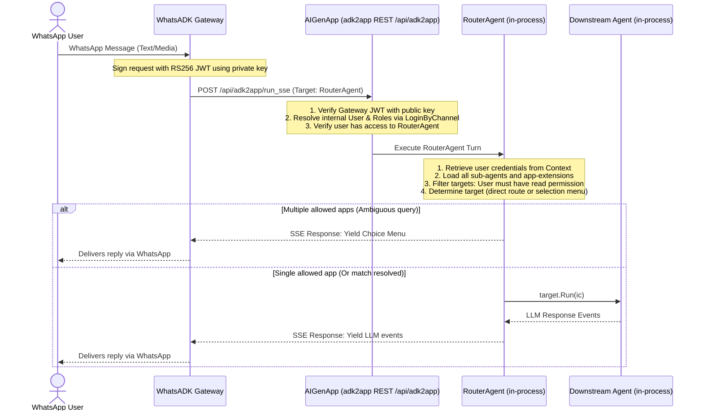

# WhatsADK to AIGenApp Agentic Gateway Integration Example

This example documents and illustrates how to configure and deploy the **WhatsADK Gateway** to connect directly to the **aigen-app** agentic application gateway.

Rather than running a standalone Router Agent (like `examples/router`), this integration maps the gateway directly to `aigen-app`'s multi-agent runtime. `aigen-app` verifies gateway authorization, resolves the WhatsApp user phone number to internal users and roles, filters sub-agents/extensions by RBAC permissions, and executes target agents in-process.

---

## 1. How It Works



---

## 2. Configuration Steps

To link the gateway and `aigen-app` securely, you must configure public key cryptography and endpoints on both sides:

### Step A: Generate RSA JWT Keys
The gateway signs HTTP requests with an RS256 JWT, which `aigen-app` validates.
From the root of the `whatsadk` directory, run:
```bash
# Create keys directory
mkdir -p secrets

# Generate RSA private key
openssl genrsa -out secrets/jwt_private.pem 2048

# Derive the corresponding public key
openssl rsa -in secrets/jwt_private.pem -pubout -out secrets/jwt_public.pem
```

### Step B: Configure the WhatsADK Gateway
Update `examples/aigen-gateway/config.yaml`:
1. Point `adk.endpoint` to your `aigen-app` URL (e.g. `http://localhost:8080/api/adk2app`).
2. Set `adk.app_name` to `"RouterAgent"`.
3. Set `auth.jwt.private_key_path` to the private key path `secrets/jwt_private.pem` generated above.

### Step C: Configure AIGenApp (`aigen-app`)
Provide the gateway's public key to `aigen-app` to allow validation:
1. Open `aigen-app`'s `config.yaml` configuration file.
2. Register the gateway's public key (contents of `secrets/jwt_public.pem` generated in Step A) under the WhatsApp channel configuration:
   ```yaml
   channels:
     whatsapp:
       public_key: |
         -----BEGIN PUBLIC KEY-----
         MIIBIjANBgkqhkiG9w0BAQEFAAOCAQ8AMIIBCgKCAQEAv...
         -----END PUBLIC KEY-----
   ```

---

## 3. Running the Gateway

Once configuration is complete, run the WhatsADK Gateway targeting the example config:

```bash
# Start WhatsADK pointing to our configuration
go run cmd/whatsadk/main.go --config examples/aigen-gateway/config.yaml
```

---

## 4. Key Benefits of This Integration

- **Security & Authorization**: Rather than bypassing permissions during gateway entry, `aigen-app` performs entry-route RBAC checking. In-process `RouterAgent` execution then performs check filters dynamically so users can only view or execute authorized sub-agents/extensions.
- **Dynamic Selection (Selection Bypass)**: If a user only has permission to execute a single downstream agent, the selection menu is skipped and they are routed straight to that application seamlessly.
- **Resource Cleanup**: The virtual file system is kept completely clean. There are no manual `router/<userID>/apps.json` or `router/<userID>/state.json` file reads/writes, resolving concurrency and synchrony issues.
