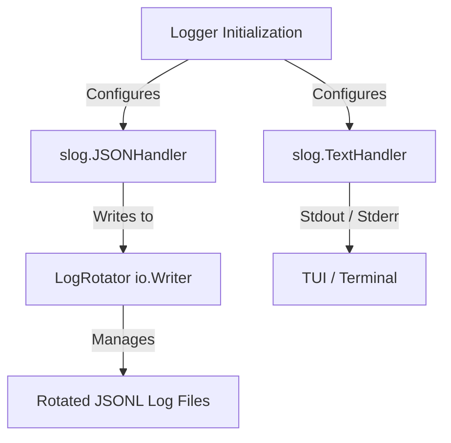

# Design Pattern: Structured Logging & Log Rotation in Go

This specification describes a clean, dependency-free design pattern for Go applications requiring concurrent structured logging (human-readable console output + machine-readable JSONL logs) along with automatic, thread-safe log file rotation and caller source file/line preservation.

---

## 1. Problem Statement

Standard logging in Go (`log/slog` introduced in Go 1.21) provides excellent structured output formatting. However:
1. **No Built-in Rotation**: The standard library does not provide a mechanism to rotate log files when they grow too large.
2. **Wrapper Caller Location Loss**: Standard library logger wrappers (i.e. wrapping `slog` inside custom methods/log structures) lose caller source location (the log location shifts to point to the wrapper line instead of the code that emitted the log).
3. **Heavy Dependencies**: Importing external log rotators (e.g. lumberjack) introduces unnecessary dependency footprints.

---

## 2. Solution Architecture

The pattern consists of three core components:



1. **`LogRotator` (`io.Writer`)**: Thread-safe file writer with automatic size-based rotation and chronological backup pruning.
2. **`MultiHandler` (`slog.Handler`)**: Multiplexes standard text format to console and JSON Lines (JSONL) format to the file rotator.
3. **Caller-Preserving Wrapper**: Custom logging method wrapper that intercepts program counters to preserve original source file locations.

---

## 3. Implementation Details & Code

### 3.1 Log Rotator (`rotator.go`)
This is a thread-safe `io.Writer` implementing file size-based rotation and backup limit pruning.

```go
package logger

import (
	"fmt"
	"os"
	"path/filepath"
	"sort"
	"strings"
	"sync"
	"time"
)

type LogRotator struct {
	mu         sync.Mutex
	dir        string
	filename   string
	maxSize    int64 // In bytes
	maxBackups int
	file       *os.File
	size       int64
}

func NewLogRotator(dir, filename string, maxSizeMB int, maxBackups int) (*LogRotator, error) {
	if err := os.MkdirAll(dir, 0755); err != nil {
		return nil, fmt.Errorf("create log dir: %w", err)
	}

	r := &LogRotator{
		dir:        dir,
		filename:   filename,
		maxSize:    int64(maxSizeMB) * 1024 * 1024,
		maxBackups: maxBackups,
	}

	if err := r.open(); err != nil {
		return nil, err
	}

	return r, nil
}

func (r *LogRotator) open() error {
	path := filepath.Join(r.dir, r.filename)
	info, err := os.Stat(path)
	if err == nil {
		r.size = info.Size()
	} else if !os.IsNotExist(err) {
		return fmt.Errorf("stat log file: %w", err)
	}

	file, err := os.OpenFile(path, os.O_CREATE|os.O_WRONLY|os.O_APPEND, 0644)
	if err != nil {
		return fmt.Errorf("open log file: %w", err)
	}

	r.file = file
	return nil
}

func (r *LogRotator) Write(p []byte) (n int, err error) {
	r.mu.Lock()
	defer r.mu.Unlock()

	writeSize := int64(len(p))
	if r.size+writeSize > r.maxSize {
		if err := r.rotate(); err != nil {
			fmt.Fprintf(os.Stderr, "log rotation failed: %v\n", err)
		}
	}

	if r.file == nil {
		if err := r.open(); err != nil {
			return 0, err
		}
	}

	n, err = r.file.Write(p)
	r.size += int64(n)
	return n, err
}

func (r *LogRotator) rotate() error {
	if r.file != nil {
		r.file.Close()
		r.file = nil
	}

	path := filepath.Join(r.dir, r.filename)
	timestamp := time.Now().Format("20060102-150405")
	ext := filepath.Ext(r.filename)
	base := strings.TrimSuffix(r.filename, ext)
	backupName := fmt.Sprintf("%s.%s%s", base, timestamp, ext)
	backupPath := filepath.Join(r.dir, backupName)

	if err := os.Rename(path, backupPath); err != nil {
		_ = r.open() // recover
		return fmt.Errorf("rename log file: %w", err)
	}

	if err := r.open(); err != nil {
		return fmt.Errorf("open new log file after rotate: %w", err)
	}

	r.pruneBackups()
	return nil
}

func (r *LogRotator) pruneBackups() {
	files, err := os.ReadDir(r.dir)
	if err != nil {
		return
	}

	ext := filepath.Ext(r.filename)
	base := strings.TrimSuffix(r.filename, ext)
	prefix := base + "."

	type backupInfo struct {
		path string
		mod  time.Time
	}

	var backups []backupInfo
	for _, f := range files {
		if f.IsDir() {
			continue
		}
		name := f.Name()
		if strings.HasPrefix(name, prefix) && strings.HasSuffix(name, ext) && name != r.filename {
			path := filepath.Join(r.dir, name)
			if info, err := os.Stat(path); err == nil {
				backups = append(backups, backupInfo{
					path: path,
					mod:  info.ModTime(),
				})
			}
		}
	}

	if len(backups) <= r.maxBackups {
		return
	}

	sort.Slice(backups, func(i, j int) bool {
		return backups[i].mod.Before(backups[j].mod)
	})

	toDelete := len(backups) - r.maxBackups
	for i := 0; i < toDelete; i++ {
		_ = os.Remove(backups[i].path)
	}
}

func (r *LogRotator) Close() error {
	r.mu.Lock()
	defer r.mu.Unlock()

	if r.file != nil {
		err := r.file.Close()
		r.file = nil
		return err
	}
	return nil
}
```

### 3.2 Structured Multiplexed Logger (`logger.go`)
This initializes the central structured logger. It leverages a custom `MultiHandler` to write text console outputs and JSON file outputs simultaneously.

```go
package logger

import (
	"context"
	"fmt"
	"log/slog"
	"os"
	"runtime"
	"strings"
	"time"
)

// MultiHandler multiplexes logs to multiple handlers
type MultiHandler struct {
	handlers []slog.Handler
}

func NewMultiHandler(handlers ...slog.Handler) *MultiHandler {
	return &MultiHandler{handlers: handlers}
}

func (m *MultiHandler) Enabled(ctx context.Context, level slog.Level) bool {
	for _, h := range m.handlers {
		if h.Enabled(ctx, level) {
			return true
		}
	}
	return false
}

func (m *MultiHandler) Handle(ctx context.Context, record slog.Record) error {
	for _, h := range m.handlers {
		if h.Enabled(ctx, record.Level) {
			if err := h.Handle(ctx, record); err != nil {
				return err
			}
		}
	}
	return nil
}

func (m *MultiHandler) WithAttrs(attrs []slog.Attr) slog.Handler {
	next := make([]slog.Handler, len(m.handlers))
	for i, h := range m.handlers {
		next[i] = h.WithAttrs(attrs)
	}
	return &MultiHandler{handlers: next}
}

func (m *MultiHandler) WithGroup(name string) slog.Handler {
	next := make([]slog.Handler, len(m.handlers))
	for i, h := range m.handlers {
		next[i] = h.WithGroup(name)
	}
	return &MultiHandler{handlers: next}
}

type Config struct {
	Level          string
	ConsoleEnabled bool
	FileEnabled    bool
	Dir            string
	FileName       string
	MaxSizeMB      int
	MaxBackups     int
}

var Log *slog.Logger = slog.Default()

// Init configures and sets the global structured logger
func Init(cfg Config) (*slog.Logger, error) {
	var level slog.Level
	switch strings.ToUpper(cfg.Level) {
	case "DEBUG":
		level = slog.LevelDebug
	case "WARN", "WARNING":
		level = slog.LevelWarn
	case "ERROR":
		level = slog.LevelError
	default:
		level = slog.LevelInfo
	}

	opts := &slog.HandlerOptions{
		Level:     level,
		AddSource: true, // Appends emitter file location to JSON
	}

	var handlers []slog.Handler

	if cfg.ConsoleEnabled {
		handlers = append(handlers, slog.NewTextHandler(os.Stderr, &slog.HandlerOptions{
			Level: level,
		}))
	}

	if cfg.FileEnabled {
		rotator, err := NewLogRotator(cfg.Dir, cfg.FileName, cfg.MaxSizeMB, cfg.MaxBackups)
		if err != nil {
			return nil, fmt.Errorf("failed to init rotator: %w", err)
		}
		handlers = append(handlers, slog.NewJSONHandler(rotator, opts))
	}

	if len(handlers) == 0 {
		handlers = append(handlers, slog.NewTextHandler(os.Stderr, &slog.HandlerOptions{Level: slog.LevelError}))
	}

	Log = slog.New(NewMultiHandler(handlers...))
	slog.SetDefault(Log)

	return Log, nil
}
```

### 3.3 Preserving Emitter Source Location in Wrapper APIs
When creating custom log wrappers (e.g., custom module logging methods), the program counter (`pc`) must be fetched at runtime dynamically. Failing to do this forces `slog` to record the wrapper's line numbers instead of the emitter's location.

Use the following method signature inside your custom log wrapper class:

```go
type CustomLogger struct {
	logger *slog.Logger
	module string
}

func (c *CustomLogger) log(level slog.Level, format string, args ...interface{}) {
	ctx := context.Background()
	if !c.logger.Handler().Enabled(ctx, level) {
		return
	}
	msg := fmt.Sprintf(format, args...)

	// Retrieve calling frame dynamically while bypassing wrapper methods
	var pcs [3]uintptr
	n := runtime.Callers(3, pcs[:]) // skips runtime.Callers, c.log, wrapper method
	var pc uintptr
	if n > 0 {
		frames := runtime.CallersFrames(pcs[:n])
		for {
			frame, more := frames.Next()
			// Exclude wrapper helper functions from tracing
			if !strings.Contains(frame.Function, "CustomLogger") && !strings.Contains(frame.Function, "runtime.") {
				pc = frame.PC
				break
			}
			if !more {
				break
			}
		}
	}

	// Create and write the record using the true call site PC
	r := slog.NewRecord(time.Now(), level, msg, pc)
	_ = c.logger.Handler().Handle(ctx, r)
}

func (c *CustomLogger) Infof(format string, args ...interface{}) {
	c.log(slog.LevelInfo, format, args...)
}

func (c *CustomLogger) Errorf(format string, args ...interface{}) {
	c.log(slog.LevelError, format, args...)
}
```

---

## 4. Key Benefits

* **No External Dependencies**: Built entirely on Go standard libraries (`log/slog`, `sync`, `os`).
* **Source Code Traceability**: Emitters are logged accurately within JSONL log files (via `AddSource` + dynamic `runtime.Callers` runtime frame traversal), allowing AI coding agents to trace execution issues back to the specific line of code.
* **TUI/Console Friendliness**: Plain, human-readable terminal prints for human operators.
* **Disk Space Safety**: Handcrafted rotation prevents log files from growing unchecked, keeping cloud/container deployments clean.
